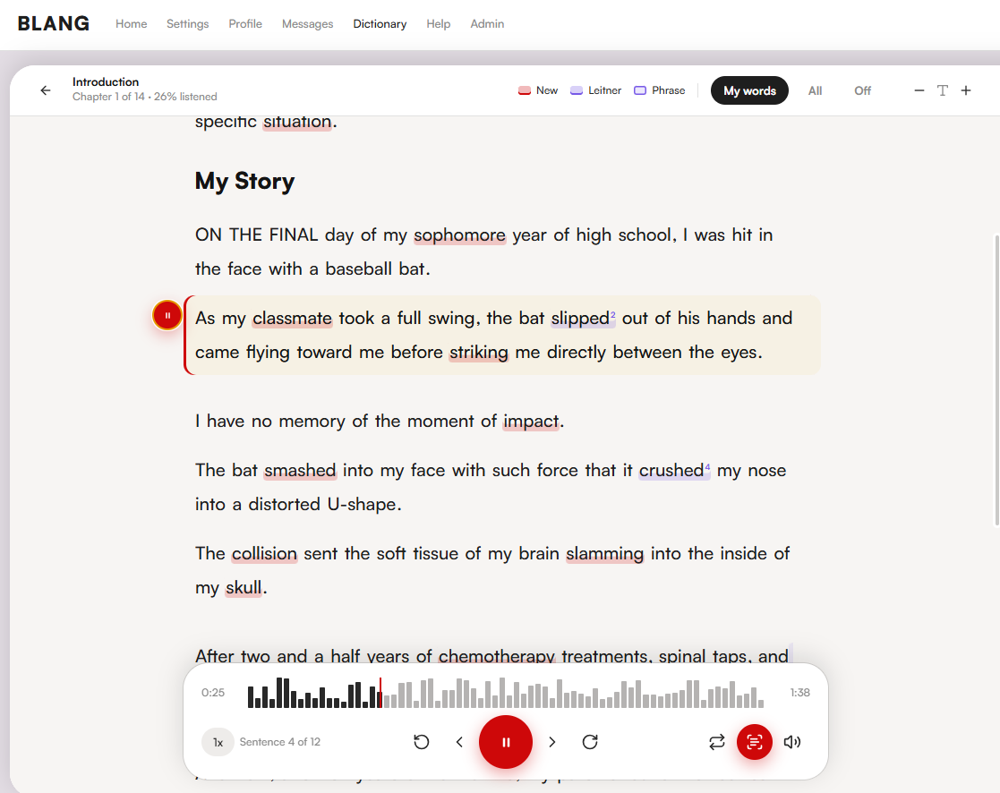
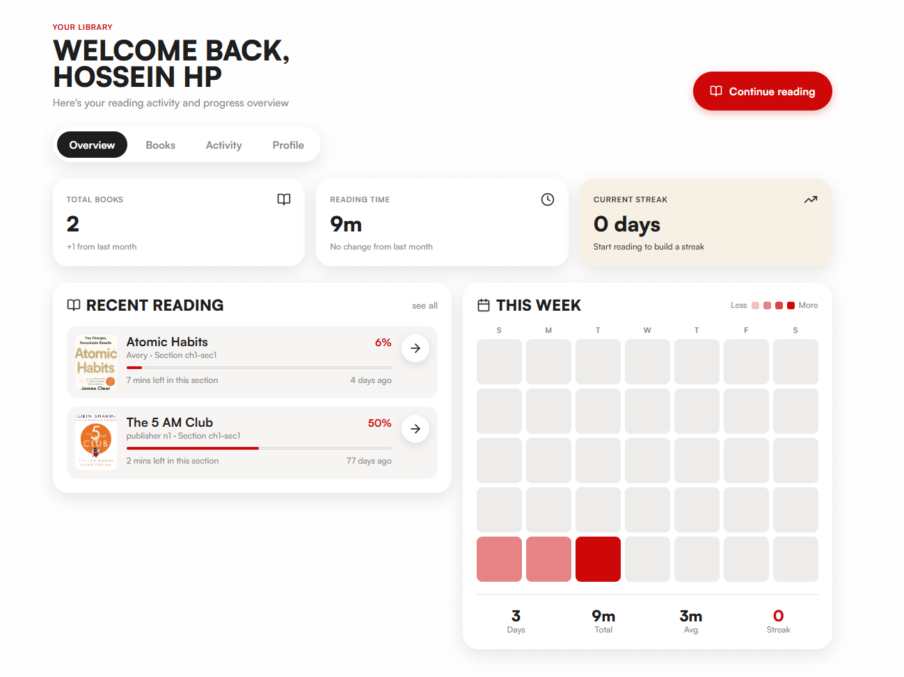
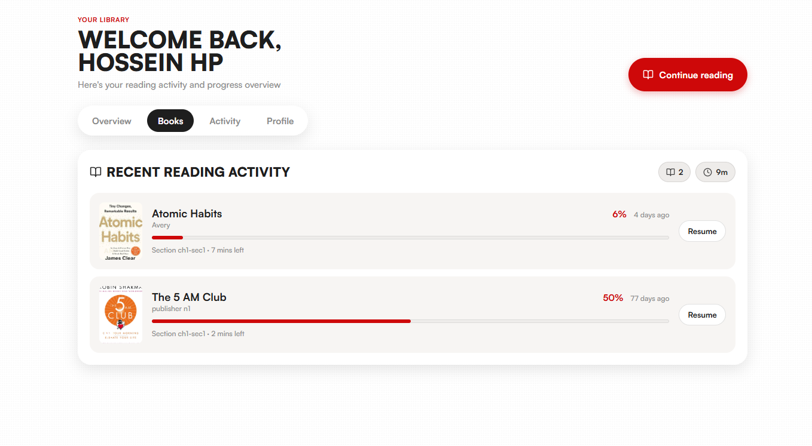
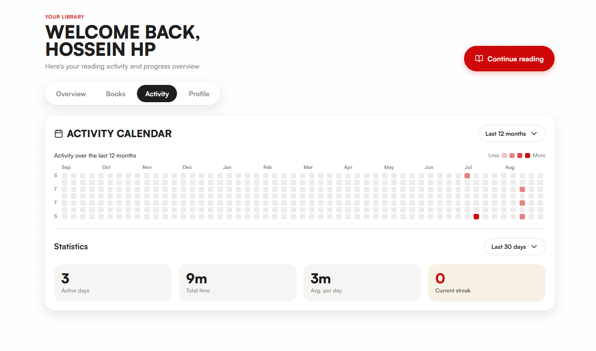
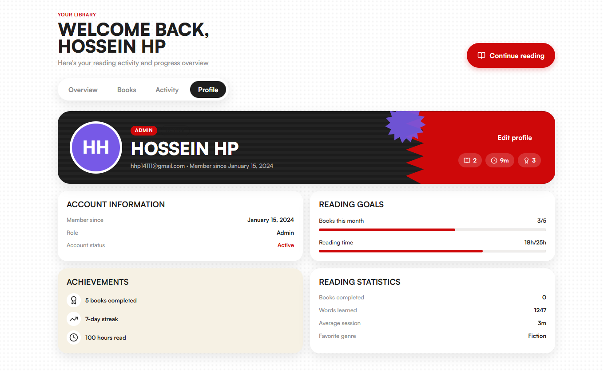
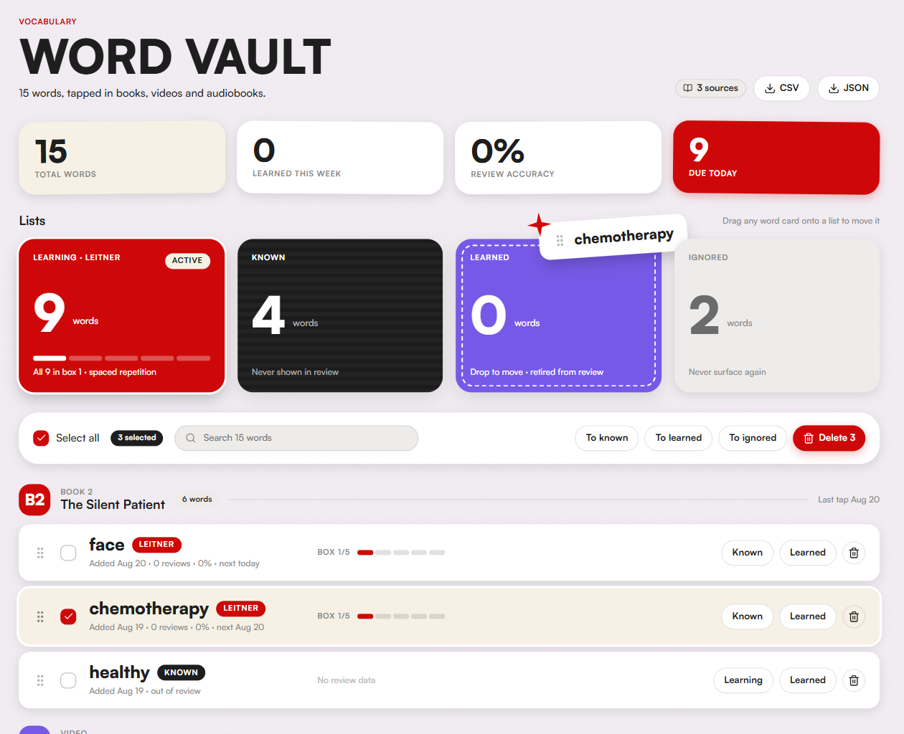
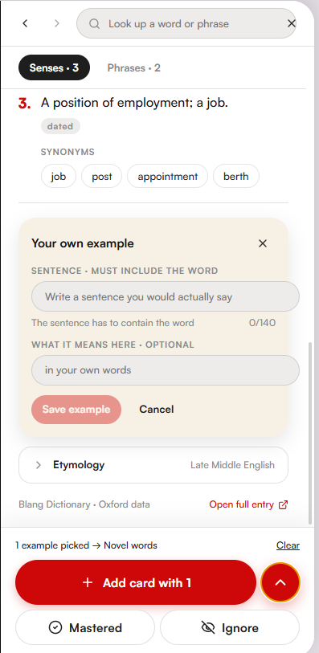
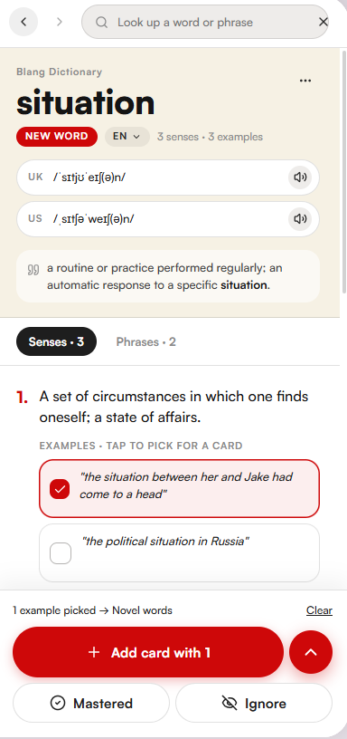
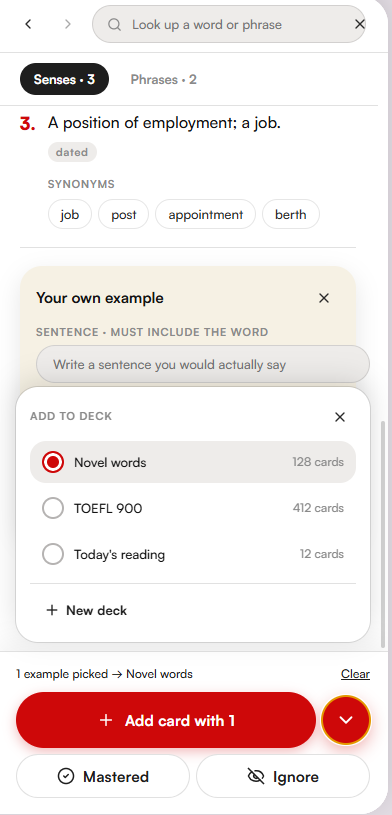
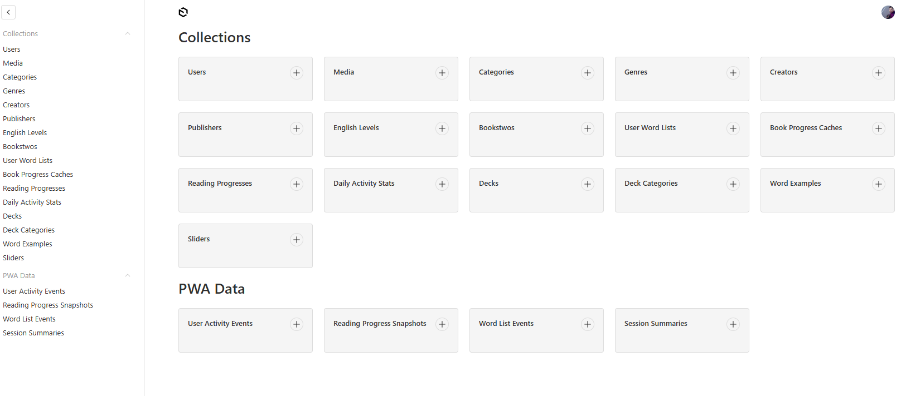

# BLANG — Digital English Learning Platform

BLANG is a full-stack English learning platform built around **reading, listening, contextual vocabulary acquisition, and spaced repetition**.

The platform connects content consumption with active vocabulary learning. Instead of separating the reader, dictionary, flashcards, and progress tracking into different tools, BLANG brings them together in one workflow.

> **Portfolio note:** This public repository is a product showcase. The application source code, environment configuration, infrastructure details, and production data are kept private.

## Product Overview

The main learning flow is:

```text
Read / Listen
      ↓
Encounter an unfamiliar word
      ↓
Open the integrated dictionary
      ↓
Choose a meaning or example sentence
      ↓
Save it to a vocabulary deck
      ↓
Review it with spaced repetition
      ↓
Move it to known / learned
```

BLANG currently includes:

- interactive book reading with chapter and section navigation
- synchronized audio and text playback
- automatic word and phrase tokenization
- contextual vocabulary highlighting
- integrated dictionary lookup
- vocabulary decks and word-state management
- Leitner-style spaced repetition
- CEFR-based content organization
- reading progress and activity tracking
- learner dashboards, goals, streaks, and statistics
- vocabulary export
- responsive and PWA-oriented UI

---

## Reading & Listening

The reader combines structured text, audio playback, and vocabulary interaction in one interface.

Key functionality includes:

- chapter and section navigation
- sentence-level reading progress
- synchronized audio using timestamped text segments
- playback controls and speed adjustment
- contextual highlighting for vocabulary states
- quick access to new, learning, and known words
- direct transition from a word in the text to dictionary lookup



---

## Learner Dashboard

The learner area provides a compact view of reading activity and progress.

It includes:

- recently opened books
- reading progress by title
- total reading time
- current streak
- weekly and historical activity
- reading goals and achievements
- personal reading statistics

### Overview



### Books

The Books view keeps active titles and current reading progress in one place.



### Activity

The Activity page summarizes reading behavior over time using an activity calendar and usage statistics.



### Profile

The Profile page combines account information, reading goals, achievements, and reading statistics.



---

## Vocabulary Management

The **Word Vault** is the central workspace for vocabulary collected across learning content.

Words can be organized into different learning states:

- **Learning / Leitner** — actively reviewed vocabulary
- **Known** — familiar words removed from regular review
- **Learned** — vocabulary considered mastered
- **Ignored** — words intentionally excluded from learning

The interface also supports:

- bulk actions
- search and filtering
- drag-and-drop style word-state management
- review status and Leitner box progress
- source tracking
- CSV and JSON export



---

## Integrated Dictionary

BLANG includes an integrated dictionary interface designed to keep vocabulary lookup inside the learning flow.

Dictionary functionality includes:

- multiple word senses
- UK and US pronunciation
- synonyms
- example sentences
- phrase entries
- contextual examples
- learner-created example sentences
- mastered and ignored word states



A learner can select an example sentence directly from a dictionary sense and use it when creating a vocabulary card.



Cards can then be assigned to different decks based on the learner's current goal or study plan.



---

## Content & Learning Structure

Learning content is organized by:

- CEFR level
- book
- chapter
- section
- category
- genre
- author

The reading system supports rich text content and associated media, while the tokenization layer identifies words and phrases that can be connected to dictionary data and learner vocabulary states.

This structure allows the platform to combine content delivery with personalized vocabulary learning.

---

## Technical Stack

### Frontend

- **Next.js 15** with App Router
- **React 19**
- **TypeScript**
- **Tailwind CSS**
- **Radix UI**
- **Framer Motion**
- **Zustand** for client state management
- **Axios**
- **Apollo Client / GraphQL**

### Backend & Data

- **Payload CMS 3**
- **PostgreSQL**
- **Drizzle ORM**
- **NextAuth.js**
- **Lexical Rich Text Editor**
- **Sharp** for image processing

### DevOps & Tooling

- **Docker**
- **Docker Compose**
- **PNPM**
- **Vitest**
- Progressive Web App support

---

## Architecture

BLANG uses a unified Next.js App Router architecture with the learner-facing application, CMS, and API layer in the same project.

At a high level:

```text
                         BLANG
                           │
             ┌─────────────┴─────────────┐
             │                           │
      Learner Application           Payload CMS
             │                           │
             └─────────────┬─────────────┘
                           │
                       API Layer
                           │
             ┌─────────────┴─────────────┐
             │                           │
       Main PostgreSQL DB         Dictionary DB
             │                           │
 users / books / progress     words / senses / phrases
 vocabulary / activity        examples / dictionary data
```

The data layer is separated into two logical databases:

1. **Main database** — users, books, reading structure, media, learner progress, vocabulary states, and CMS data.
2. **Dictionary database** — dictionary entries used by the tokenization and lookup services.

This separation keeps high-volume dictionary data independent from the main application data model.

---

## Content Management & Admin

BLANG includes an internal admin interface for managing the platform's content and learning data.

The CMS is used to manage areas such as:

- users and media
- books, categories, genres, creators, and publishers
- CEFR / English levels
- learner word lists and decks
- reading progress and daily activity statistics
- word examples
- activity events, progress snapshots, and session summaries

This keeps content management and learner-facing functionality separated while using the same application architecture.



---

## Tokenization & Vocabulary Flow

One of the core technical parts of the platform is the text-processing pipeline.

Book content is processed so that words and phrases can be connected to dictionary entries and learner-specific vocabulary states.

Conceptually:

```text
Book / Section Content
        ↓
Text Tokenization
        ↓
Word & Phrase Recognition
        ↓
Dictionary Matching
        ↓
Learner Vocabulary State
        ↓
Reader Highlighting / Dictionary / Review
```

This allows the same word to behave differently for different learners depending on whether it is new, being reviewed, already known, learned, or ignored.

---

## Audio Synchronization

Reading content can be connected to audio using timestamp-based synchronization.

This allows the reader to:

- follow playback at sentence level
- move between text and audio positions
- track listening progress
- keep the current sentence visually connected to the audio

The goal is to support reading and listening as one activity rather than two separate modes.

---

## Learning Design

The platform is centered on **contextual vocabulary acquisition**.

A word is first encountered inside meaningful content, then becomes part of the learner's personal vocabulary system. Dictionary lookup, example selection, deck creation, and later review all remain connected to the original learning context.

The product therefore combines:

```text
Content consumption
        +
Vocabulary discovery
        +
Dictionary lookup
        +
Spaced repetition
        +
Progress tracking
        +
Learner analytics
```

into one continuous workflow.

---

## Related Learning Analytics Project

A separate analytics project uses a learning-platform dataset to explore learner engagement and completion behavior with **Excel and Power BI**.

The analysis includes:

- learner engagement
- start and completion rates
- course and CEFR performance
- learner segmentation
- cohort analysis
- interactive Power BI dashboards

**[Learning Analytics Project](YOUR_ANALYTICS_REPOSITORY_LINK)**

---

## Repository Purpose

This repository is intended as a public product and portfolio showcase.

It contains screenshots and product documentation only. The application source code, private configuration, credentials, infrastructure details, and production data are intentionally not included.
